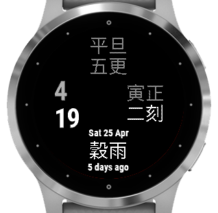

# Eleven Forty-Five

Eleven Forty-Five (11:45，午時三刻) is a [Garmin Connect IQ](https://apps.garmin.com/en-US/) watchface , which displays current time and date along with [traditional Chinese timekeeping](https://en.wikipedia.org/wiki/Traditional_Chinese_timekeeping) notation and Chinese [Solar Term](https://en.wikipedia.org/wiki/Solar_term). Note that the solar term will be inverted in southern hemisphere should user choose to show southern hemisphere solar term.

## 中文介紹

"午時三刻"是個[Garmin Connect IQ](https://apps.garmin.com/en-US/) 錶面(watchface)，顯示現在時間，並用古代計時法（時,刻）顯示現在時辰。日期的部分除了顯示英文的現在日期，也一併計算目前最靠近的二十四節氣名稱。（使用者可以設定是否顯示南半球二十四節氣，設定成南半球會反轉節氣，）

## Download

[View on Garmin Connect IQ Store](https://apps.garmin.com/en-US/apps/e8b18a43-2f35-4cc7-a403-f0a871115d93)

The watchface consists of just time and date (in modern clock and date in English) along with Chinese time and solar term.

## Overview

This is a Garmin Watchface app. It simply shows you current time both in modern and in traditional Chinese time notation. Additionally, it displays Chinese solar term along with English date.

## Status

Tested on Fenix 6 Pro and vivoactive 4s.
